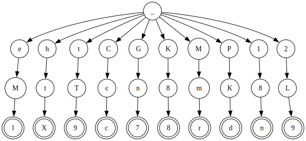

# Text Indexing WS 2024/25

My C implementation of the assignment for text indexing course for the
WS 2024/25. In brief, the task is to implement three trie variants.

## Structure

The fixed-size, variable-size array and hash-map versions of the trie are
implemented. A general trie implementation is given in `trie.c` and `trie.h`
that separates the tree traversal from the specific implementations.
`specific_trie.h/c` abstract the calls to the specific node calls.


## Development

`gcc` with a suitable version (in my case `13.3.1 20240614`) is
required. `make` is a handy addon to handle the compilation. The C
standard library is the only dependency.

To build the executable, run `make` in the project directory. The
executable `ti_program` is created and can be used as described by the
task. Run `make test` to run the test suite. `ti_programm` by itself
prints the help message:

```txt
Usage: ti_programm [-tpdu] -variante=n INPUT_FILE QUERY_FILE

The main entry point for the text indexing exercise 2024/25.

options:
-variante   VARIANTE,  selects the variant to run, in [1, 3].
-t          TASK_MODE,  displays the execution status of each word in the query. One status per line. DEFAULT
-p          PRINT_MODE,  prints the result of each command. One per line.
-d          DOT_MODE,   displays the generated trie in a DOT readable format.
-u          DUMP_MODE,  dumps the trie one word per line.
```

Note that some nice-to-have features are added and can be opted in via
the cli arguments.

### Tools

Some common tools are found under `tools`. They aim to support the
development process.

### Sqlplot-tools

The [`sqlplot-tools`](https://github.com/bingmann/sqlplot-tools/) can
be used to generate performance plots. Run `make sqlplot-tools` to
initialize the submodule and compile the tools. Make sure that the
required dependencies by sqlplot-tools are installed.

### Graph Creation - Does not work for now

The `dot` representaiton of the final trie can be generated to have a
standardized representation. Invoke the `-d` option to output this
format:

``` txt
./tools/create_fake_data.c 3 10 > creation.txt
./ti_programm -d creation.txt query.txt | dot -Tsvg > test.svg
open_command test.svg
```



## ToDo

- [x] 🌲 Implement the general trie traversal routines
  - [x] Insert
  - [x] Contains
  - [x] Delete
- [x] 📋 Implement the fixed sized array version
  - [x] Insert
  - [x] Contains
  - [x] Delete
- [x] 📏 Implement the variable sized array version
  - [x] Insert
  - [x] Contains
  - [x] Delete
- [x] 🗃️  Implement the hash table version
  - [x] Insert
  - [x] Contains
  - [x] Delete
- [x] Add the code to handle the cli
- [x] Add the contruction from input file routine
- [x] Add the queries from input file routine
- [x] Format the output according to the task
- [x] Add a suitable test suite
- [x] Controll if the query null terminator before the action is
      prefixed with a space
- [x] Implement a cleanup (free) function
